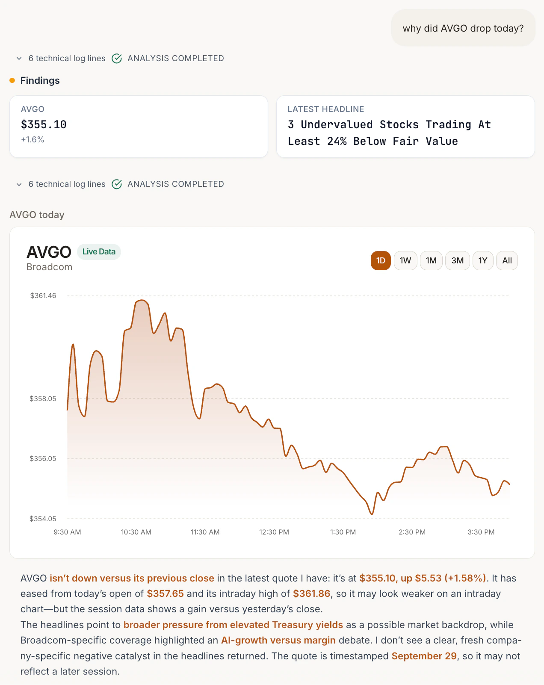
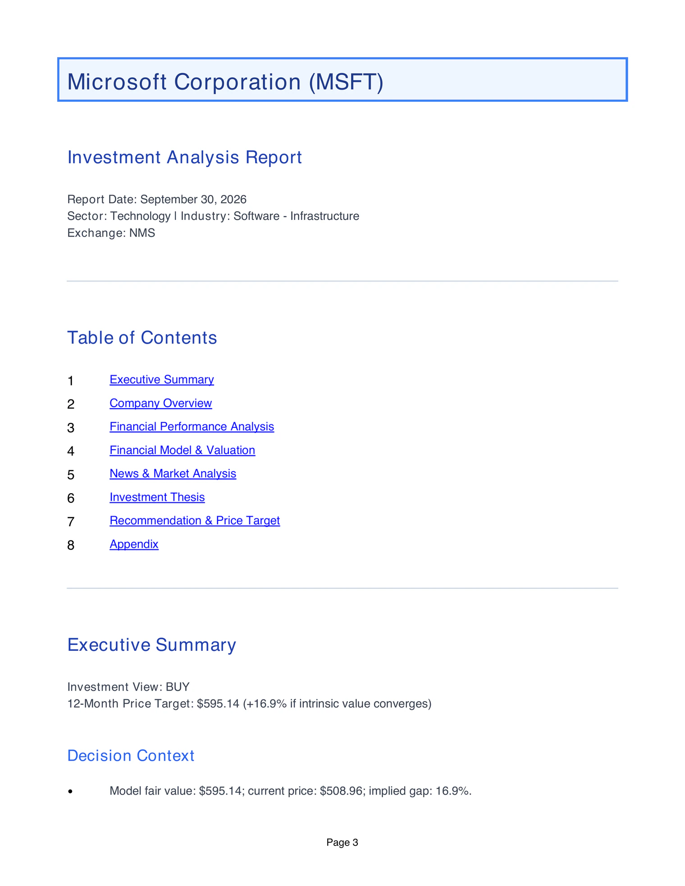
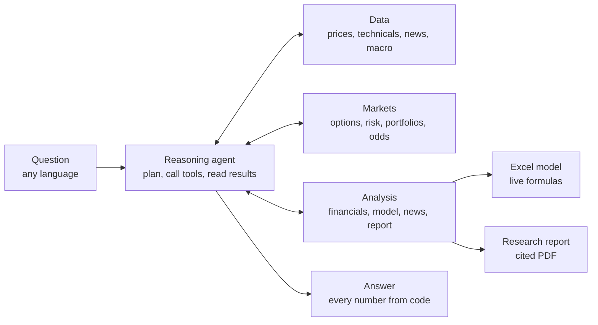

<div align="center">


# The agent behind VYNN AI

**A personal, trustworthy AI financial analyst.**<br>
Ask about a company in plain words, in any language. The agent decides what the question needs, and code computes every number it gives you.

[Website](https://vynnai.com) · [Try VYNN](https://app.vynnai.com) · [Research records](https://vynnai.com/research) · [Demo video](https://www.youtube.com/watch?v=aXR1ZIEdezs)

[](https://github.com/Agentic-Analyst/stock-analyst/actions/workflows/ci.yml)
[](https://www.python.org/downloads/release/python-3110/)
[](https://deepwiki.com/Agentic-Analyst/stock-analyst)
[](LICENSE)

</div>

<p align="center">
  
  
</p>
<p align="center"><sub>Real output from the production app: a quick answer in seconds, and a page from the report of a full analysis.</sub></p>

## What you can ask

| You ask | The agent |
|---|---|
| "Analyze NVDA. Should I buy?" | Pulls the financials, builds a 10-tab valuation model, screens the news and writes a cited report, then answers |
| "分析英伟达，用中文写报告" | Runs the same analysis and writes the report in Chinese |
| "How would falling rates hit US banks?" | Reasons from live macro data. No full analysis, answer in seconds |
| "Flag breakdowns on NVDA and AAPL" | Computes technicals for both and gives the actual levels |
| "Price a 30-day NVDA 150 call" | Black-Scholes value with delta, gamma, theta and vega |
| "Best Sharpe weighting for AAPL, MSFT, NVDA?" | Solves the max-Sharpe portfolio and explains the trade-offs |
| "Odds of a Fed rate cut?" | Reads the market-implied probability from prediction markets |
| "What's the outlook for Bitcoin?" | A live crypto snapshot, and no DCF: a coin has no cash flows |

The heavy path, financials to model to news to report, runs only when a question needs it, and takes about two minutes. Everything else answers in seconds.

## How it works

One reasoning loop and a set of tools. The agent reads the request, calls the tools it needs (or none), reads their JSON results and either calls more or answers. There is no fixed pipeline and no intent menu.



The four analysis stages are tools that share one state object, so a full run keeps its order (data, then model, then news, then report) while independent work runs in parallel. Tools register themselves with schemas for both OpenAI and Anthropic, so the same loop runs on either provider.

| Group | Tools |
|---|---|
| Data | `resolve_symbol` (any-language name to ticker), `get_prices`, `get_technicals`, `get_global_news`, `get_macro` (FRED) |
| Analysis | `get_financials`, `build_model`, `analyze_news`, `write_report`, `read_report`, `compare_tickers` |
| Funds and crypto | `get_fund` (fees, holdings, allocation; never a DCF), `get_crypto` |
| Markets | `price_option`, `compute_risk_metrics`, `optimize_portfolio`, `get_prediction_markets` (Polymarket) |
| Interface | `show_chart`, an interactive price chart drawn in the chat |

`get_macro` needs a free FRED key; without one, the agent is simply not offered that tool.

## Why the numbers hold up

- **Code owns every number.** A symbolic DCF engine builds the valuation, and a deterministic calculator sets the rating and the 12-month target. The language model writes the narrative. A validator corrects any figure that differs from the calculator's and, whenever the run has evidence to cite, requires at least 95% of the narrative's material sentences to cite it.
- **The workbook is the source of truth.** All formulas are live: change one assumption and the projections, both valuations, the sensitivity tables and the summary recompute.
- **Two methods that agree by construction.** Perpetual growth and exit multiple are reconciled so they describe the same future. The spread that remains is classified, and a method that fails, such as a negative value for a cash-burning company, is reported as failed, not averaged in.
- **Inputs from published data.** The discount rate is built from the government yield in the currency of the cash flows, Damodaran's equity risk premium and a regressed beta. Every input is printed with its source.
- **Flagged, not hidden.** When well-covered analysts disagree with the model, VYNN still answers. It shows both positions side by side, in the chat, on the report's first page and in the workbook. The call is yours.
- **Checked every night.** A canary rebuilds a fixed basket of companies with the released engine. A release ships only with zero unexplained differences from the expected outcomes.
- **Untrusted text stays data.** News articles, search results and replayed history enter the context marked as data, never as instructions. A headline saying "ignore your rules" is analyzed, not obeyed.

The details, from cost of capital to the calibration benchmark, are in [How it works](docs/how-it-works.md).

## Real output

Five research records from the current engine, each with its full report and model:

| Company | Run | Fair value | Price | Rating |
|---|---|---|---|---|
| [Microsoft](https://vynnai.com/research/msft) | 30 Sep 2026 | $595.14 | $508.96 | Buy |
| [NVIDIA](https://vynnai.com/research/nvda) | 3 Oct 2026 | $350.82 | $233.95 | Strong Buy |
| [Alphabet](https://vynnai.com/research/googl) | 3 Oct 2026 | $399.69 | $343.50 | Buy |
| [Visa](https://vynnai.com/research/v) | 3 Oct 2026 | $373.75 | $360.66 | Hold |
| [Apple](https://vynnai.com/research/aapl) | 3 Oct 2026 | $224.55 | $333.69 | Strong Sell, flagged |

Each record states its confidence and its sources. Microsoft's [report](samples/MSFT-research-report.pdf) and [model](samples/MSFT-financial-model.xlsx) are also in [`samples/`](samples). Research, not investment advice.

## Quickstart

Requires Python 3.11 and an OpenAI API key.

```bash
git clone https://github.com/Agentic-Analyst/stock-analyst.git
cd stock-analyst
python3.11 -m venv .venv && source .venv/bin/activate
pip install -r requirements.lock
cp .env.example .env          # set OPENAI_API_KEY

python main.py --pipeline chat --email you@example.com --timestamp 20260101_120000 \
  --user-prompt "Analyze NVDA. Should I buy?"
```

Continue a conversation with `--session-id`. For scripted runs without the agent, pass `--ticker` and one of the pipelines: `comprehensive`, `financial-statements`, `financial-model`, `search-news`, `screen-news`, `company-daily-report` or `sector-daily-report`.

Each run writes to `data/<email>/<TICKER>/<timestamp>/`:

```
financials/   statements and market data, as collected
models/       the Excel model and its computed values
searched/     news found for the run
screened/     catalysts and risks, with quotes and sources
reports/      the research report
answer.md     the answer
info.log      the full run log
```

With Docker:

```bash
docker build --target production -t stock-analyst .
docker run --rm --env-file .env -v "$(pwd)/data:/data" stock-analyst \
  --pipeline chat --email you@example.com --timestamp 20260101_120000 --user-prompt "Analyze NVDA"
```

## Configuration

Only `OPENAI_API_KEY` is required. [`.env.example`](.env.example) documents every setting.

| Variable | What it enables |
|---|---|
| `OPENAI_API_KEY` | The default provider (`gpt-6-luna`) |
| `ANTHROPIC_API_KEY` | Claude models, as an alternative to OpenAI |
| `CHAT_MODEL`, `--llm` | Model choice; `python main.py --list-llms` lists them |
| `SERPAPI_API_KEY` | Richer news discovery |
| `FRED_API_KEY` | The `get_macro` tool (free key) |
| `MONGO_URI`, `MONGO_DB` | Article cache and conversation memory |
| `BENZINGA_API_KEY`, `FINNHUB_API_KEY` | Licensed analyst consensus, used as a benchmark and never as a valuation input |

## Project layout

```
main.py                 command line entry point
src/agents/
  generalist_agent.py   the reasoning loop
  tools/                the tools, one module per group
  fm/                   the DCF engine, one builder per workbook tab
  news/                 daily intelligence reports
src/llms/               one interface over OpenAI and Anthropic, with retries and a circuit breaker
src/recommendation_*    the deterministic calculator and the validator
src/confidence_alert.py the flag shown when analysts disagree
prompts/                34 prompt templates, versioned as Markdown
scripts/                the nightly valuation canary and its expectations
tests/                  the test suite CI runs on every change
```

## Tests

```bash
pip install -r requirements-test.lock
python -m pytest tests/ -q -p no:cacheprovider
```

CI runs the same suite on every pull request into `main` and every push to it.

## Limitations

- **A DCF does not fit every company.** Pre-revenue and deeply cash-negative businesses get a range and a caveat, not a price target.
- **Calibration is not yet an accuracy claim.** That needs a versioned cohort and a real 12-month outcome backtest, which the benchmark supports but does not yet have.
- **News lags.** Google News results can trail breaking news by 15 to 30 minutes, so this is not an intraday signal.
- **Yahoo Finance throttles bursts.** Requests retry with backoff but are not queued across simultaneous analyses.
- **Obscure names may need the ticker.** Names in other scripts are resolved by transliteration plus search.

## Contributing, security, license

Issues and pull requests are welcome. Tools, workbook tabs and prompts extend independently: a new tool is one self-registering module. See [SECURITY.md](SECURITY.md) to report a vulnerability.

The source is available to read and evaluate. Use, copying, modification or distribution requires written permission from VYNN AI; see [LICENSE](LICENSE). Contributions are assigned to VYNN AI under its terms.
